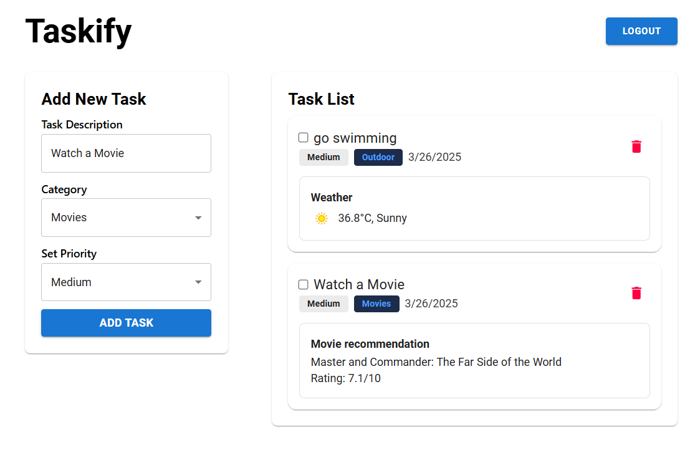

# Taskify - A Todo application with API

## Introduction

Taskify is a modern to-do web application built with React, Redux and Material UI. Only authenticated Users can add tasks based on various activity and Priority list. There is a good looking UI of the application that shows the running task and completed task. Also, the added tasks are persisted through the localStorage. Interesting fact is that, the localStorage is persisted through Redux store's middlewares. The Api request comes through the Redux Thunk. The website is fully responsive.

Live Link: [Click here](https://taskify-tech.netlify.app/)



## Feature

- **Persisted Authentication**: Authentication is persisted through localStorage and it was implemented using Redux middleware.
- **Good looking UI**: the UI was implemented using Material design system (Via Material UI) and TailwindCSS
- **Used Redux Thunk**: Redux createAsyncThunk function was used to fetch API for Weather, Books and Movies data.
- **localStorage Integration with Redux Middleware**: Data is persisted through localStorage and it is maintained by the Redux middleware.
- **Scalablity**: The Code system and Folder structure is maintainable and enough to scale the application furthure.

## Tech Stack

- Language: JavaScript
- Libraries and packages: React, Redux, Tailwind, Material UI, axios
- API: JSON fake API, WeatherAPI, Google Books API

## dependencies used

```  
"dependencies": {
    "@emotion/react": "^11.14.0",
    "@emotion/styled": "^11.14.0",
    "@mui/material": "^6.4.8",
    "@reduxjs/toolkit": "^2.6.1",
    "@tailwindcss/vite": "^4.0.15",
    "axios": "^1.8.4",
    "react": "^19.0.0",
    "react-dom": "^19.0.0",
    "react-hot-toast": "^2.5.2",
    "react-icons": "^5.5.0",
    "react-redux": "^9.2.0",
    "react-router": "^7.4.0",
    "tailwindcss": "^4.0.15"
  },
```
